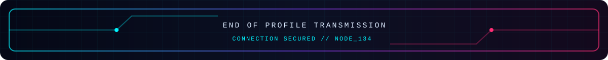

 

 

<table width="100%">
<tr>
<td width="62%" valign="top">

<h2>⌁ SYSTEM.IDENTITY</h2>

<pre>
user        : sabry134
role        : full_stack_developer
speciality  : ai | cybersecurity | automation
environment : frontend | backend | software
availability: freelance_projects
status      : building
</pre>

I am a full stack developer working on frontend, backend and software projects.

My work mainly focuses on building complete applications, automation systems, AI-powered tools, dashboards, APIs and security-aware user flows.

I also work as a freelancer on specific project requests, from the initial idea to a complete and deployable solution.

</td>
<td width="38%" valign="top">

<h2>⌁ CURRENT.FOCUS</h2>

<pre>
[01] Full Stack Development
[02] Artificial Intelligence
[03] Cybersecurity
[04] Backend Architecture
[05] Automation Systems
[06] Custom Software
</pre>

<h2>⌁ CORE.PRINCIPLES</h2>

<pre>
> Clean interfaces
> Reliable systems
> Secure workflows
> Maintainable code
> Practical solutions
</pre>

</td>
</tr>
</table>

 

<h2>⌁ TECHNOLOGY.ARSENAL</h2>

  

 

 

<h2>⌁ DEVELOPMENT.MODULES</h2>

<table width="100%">
<tr>
<td width="50%" valign="top">

<h3>01 // FRONTEND</h3>

Clean, responsive and modern interfaces designed around usability and clear information.

<pre>
HTML
CSS
JavaScript
Responsive interfaces
Interactive dashboards
User experience
</pre>

</td>
<td width="50%" valign="top">

<h3>02 // BACKEND</h3>

APIs, databases, authentication systems, automation and scalable application logic.

<pre>
Node.js
Express
MongoDB
REST APIs
Authentication
Server architecture
</pre>

</td>
</tr>
<tr>
<td width="50%" valign="top">

<h3>03 // ARTIFICIAL_INTELLIGENCE</h3>

Practical AI integrations designed to automate work and improve existing systems.

<pre>
AI-powered tools
Workflow automation
Data processing
Intelligent assistants
Custom integrations
</pre>

</td>
<td width="50%" valign="top">

<h3>04 // CYBERSECURITY</h3>

Security-aware systems, protected user flows and tools designed around safer operations.

<pre>
Secure authentication
Access control
Security monitoring
Log analysis
Risk detection
Protected APIs
</pre>

</td>
</tr>
</table>

 

<h2>⌁ GITHUB.TELEMETRY</h2>

 

<h2>⌁ PROJECT.CAPABILITIES</h2>

<table width="100%">
<tr>
<td align="center" width="25%">

<h3>FULL STACK</h3>

Complete web applications connecting interfaces, APIs, databases and deployment systems.

</td>
<td align="center" width="25%">

<h3>AUTOMATION</h3>

Bots, scheduled processes, reporting tools and automated operational workflows.

</td>
<td align="center" width="25%">

<h3>DASHBOARDS</h3>

Custom platforms for statistics, KPIs, administration, monitoring and project management.

</td>
<td align="center" width="25%">

<h3>SOFTWARE</h3>

Custom software designed around precise project requirements and real operational needs.

</td>
</tr>
</table>

 

<h2>⌁ PROJECT.SIGNAL</h2>

  

  

  

